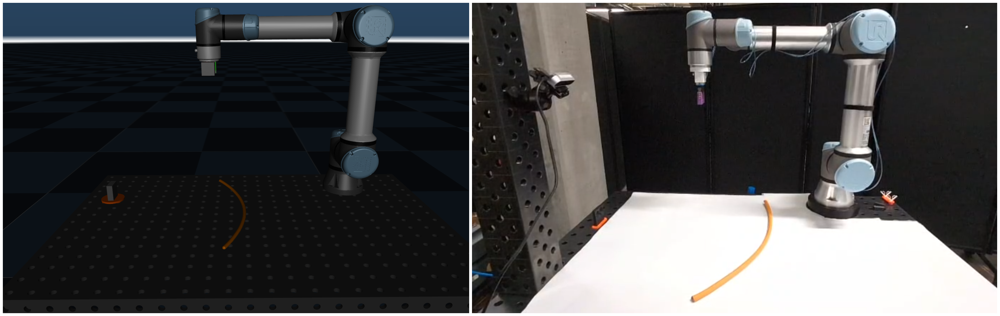
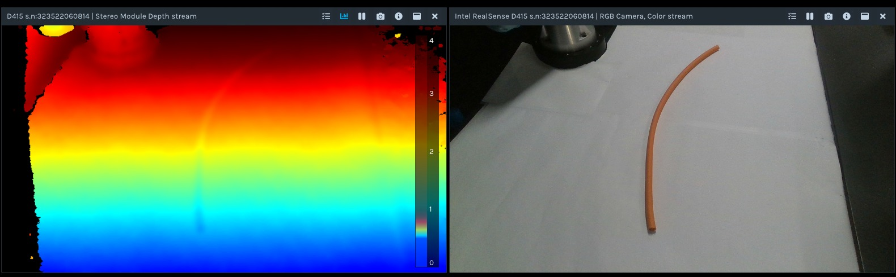
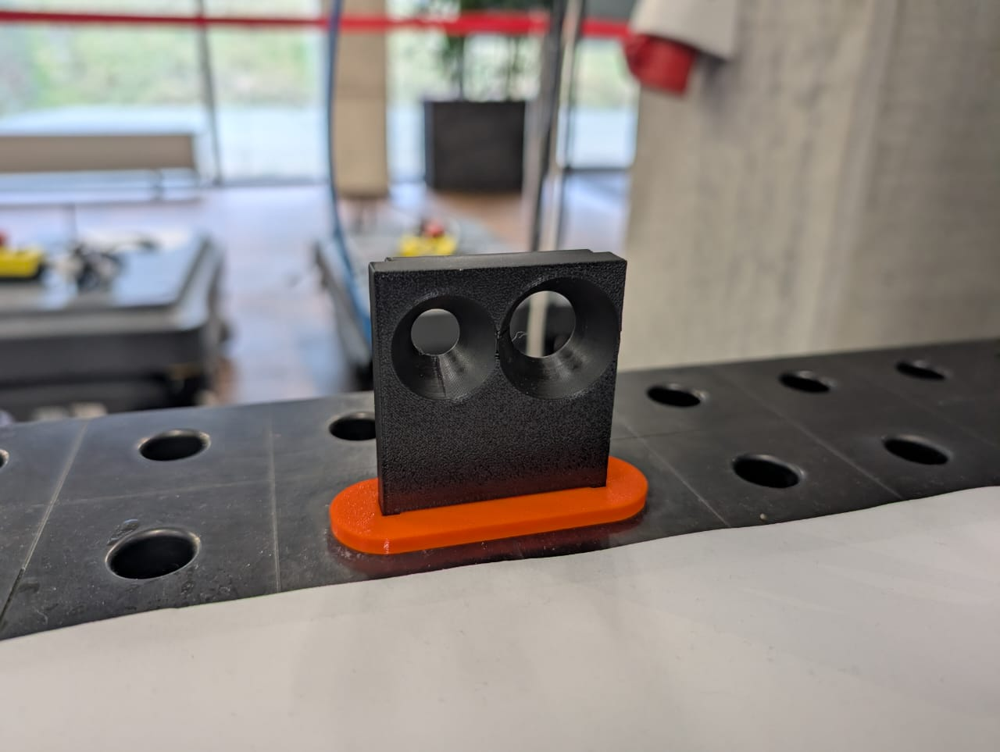
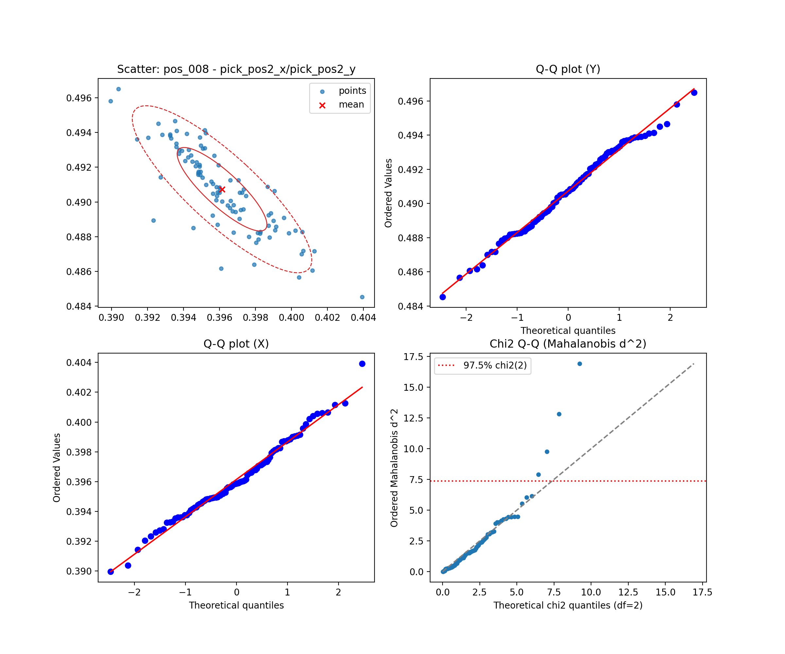
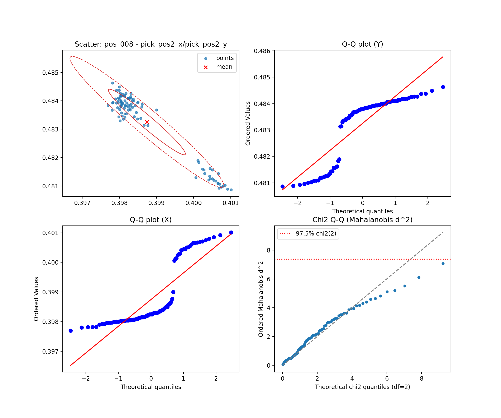

# Automating Cable Installation (RoboSpool)

Automating the crimping of electrical cables: detecting a randomly-placed, flexible cable on a table with an RGB-D camera, picking it up with a UR5e manipulator and a custom pneumatic gripper, and inserting its end into a crimping-machine mockup with millimeter precision. Two wire-detection strategies — a state-of-the-art deep tracker (TrackDLO) and a lightweight HSV color pipeline — are implemented and statistically compared. Team project (with Filip Jasek and Vasileios Pasios) for the Engineering of Innovative Robotic Technologies course, SDU. My contribution was the MuJoCo simulation of the robot and cable.



## At a glance

| | |
|---|---|
| **Robot** | UR5e manipulator with a Festo DHPS-16-A-NO pneumatic gripper and custom 3D-printed claws |
| **Sensing** | Intel RealSense D415 RGB-D camera, calibrated to the robot base with ArUco markers |
| **Detection methods** | TrackDLO (deep, graph-based DLO tracking) vs. a lightweight HSV color-segmentation + skeletonization pipeline |
| **Task** | Detect a randomly-placed cable, pick it, and insert its end into a crimping-station mockup |
| **Simulation** | MuJoCo scene of the UR5e, table and cable, driven by a damped-least-squares inverse-kinematics controller |
| **Result** | 98% (HSV) / 100% (TrackDLO) success on an orange cable; 96% (HSV) on a thinner green cable that TrackDLO couldn't track reliably |

## Why two detection methods

TrackDLO models the wire as a continuous 3D curve and exploits temporal consistency across frames, which makes it robust and repeatable — but computationally heavy, since it relies on a deep segmentation network plus graph-based optimization. As a lightweight alternative for structured, known environments, we built a classical OpenCV pipeline: threshold the image in HSV space, clean the mask with morphological open/close, skeletonize it to a one-pixel-wide centerline, and reproject the skeleton into 3D using the depth image and the camera-to-base calibration. Wire endpoints and pick points are then found with a farthest-point search over the resulting 3D point cloud.

## Simulation


Before touching the real robot, I built a MuJoCo scene mirroring the physical setup — the UR5e on its table, a 3D-scanned mesh of the actual lab table, and the cable as a chain of capsule geoms — so the pick-and-place motion could be designed and checked for collisions safely. The manipulator is driven by a pure position IK controller: an iterative damped-least-squares loop that writes joint targets directly to the (kinematic, non-dynamic) actuators every control step; that was enough fidelity for this demonstration, since the workspace has no singularities. The gripper closes with soft compliance to hold the cable without crushing it.

Building a convincing simulated cable took a few passes — `wrap_cable.py` and `transform_cable.py` place and orient the capsule chain in the scene, and `rebuild_cable.py` re-smooths and re-samples it into a consistent, evenly-spaced curve (see `models/cable_scene.xml` for the final scene).

## Robot control

The `ur_rtde` Python API drives the real UR5e. Trajectories are planned from a sequence of via points in the world frame, converted to joint space via inverse kinematics, and executed with `servo_J`. A base-mount twist of −π/8 around the z-axis has to be accounted for when converting between the world frame and the robot's own frame, and via points are checked for joint-angle discontinuities (the IK solver only returns angles within ±π, which can otherwise produce unnecessary ±2π joint flips even though the target is within the UR5e's actual joint limits).

## Wire detection



**TrackDLO** — used via its [official implementation](https://github.com/RMDLO/trackdlo), run separately over the calibrated RGB-D stream to get a dense 2D wire point set, an ordered centerline, and estimated endpoints, all reprojected into 3D. Robust and repeatable across trials, but unable to track our thinner green cable consistently.

**HSV pipeline** (`src/analysis`, math detailed in the report) — segment by color in HSV space, clean with morphological filtering, skeletonize, and reproject each skeleton pixel into 3D with the camera intrinsics and the camera→base transform. Pick positions are the points a fixed offset from each endpoint along the wire direction. Fast and simple, but sensitive to lighting and needs its thresholds re-tuned when conditions change.

Both were compared using 100 detection trials at each of 10 wire positions (in isolation, without the robot moving), giving mean/variance and MAE/MSE/RMSE for wire endpoints and pick positions, and a normality check (Shapiro–Wilk / Henze–Zirkler) on the resulting distributions.

## Experimental prototype



A custom adapter and 3D-printed claws mount the Festo gripper for flat, high-grip cable handling within its 10 mm stroke. Cable insertion targets a plastic mockup of a manual crimping station (inspired by the Weidmüller CRIMPFIX ECO), treated as rigidly fixed relative to the robot.

## Results

| Cable | HSV thresholding | TrackDLO |
|---|---|---|
| Orange (Ø13 mm) | 98% | 100% |
| Green (Ø8 mm) | 96% | did not track reliably |

 

*Q-Q / scatter diagnostics for one of the 15 test positions, HSV (left) vs. TrackDLO (right) — part of the bivariate-normality analysis over all 15 × 100-sample position sets (full CSVs in `results/`).*

Detection accuracy was the deciding factor for the whole pipeline: whenever the camera returned a correct, precise pick position, the grasp and crimping-hole insertion essentially always succeeded — every recorded failure traced back to a bad detection, not the manipulation itself.

[Watch the robot demo](assets/demo.mp4) · [Watch TrackDLO tracking the cable in RViz](assets/trackdlo-tracking-demo.webm)

## Repository structure

```
Automating Cable Installation (RoboSpool)/
├── README.md
├── src/
│   ├── control/                        MuJoCo IK / pose / gripper control for the simulated UR5e
│   │   ├── ur5e_position_ik_controller.py
│   │   ├── ur5e_pid_pose_controller.py
│   │   ├── gripper_control.py
│   │   ├── gripper_utils.py
│   │   └── ur5e_visualize.py
│   ├── cable/                          building and refining the simulated cable
│   │   ├── wrap_cable.py               places/wraps the capsule chain in the scene
│   │   ├── transform_cable.py          repositions/reorients the cable
│   │   ├── rebuild_cable.py            resmooths + resamples it into an even curve
│   │   └── set_ur5e_pose.py            visual-only UR5e pose helper
│   └── analysis/
│       └── bivariate_normality_colab.py   statistical comparison of the two detection methods
├── models/
│   ├── ur5e/                           UR5e MuJoCo model (MJCF + meshes)
│   ├── table/                          3D-scanned mesh of the lab table
│   ├── scenes/                         base MuJoCo scenes (robot + table, no cable)
│   └── cable_scene.xml                 final scene used for the simulation renders
├── docker/                             containerized MuJoCo + ROS 2 environment
│   ├── Dockerfile
│   ├── requirements.txt
│   └── .dockerignore
├── results/                            recorded detection trials + statistical comparison
│   ├── analysis_data/                  raw per-position samples (HSV + TrackDLO), 15 positions
│   ├── Bill_bivariate_normality_summary.csv     HSV method summary
│   ├── TrackDLO_bivariate_normality_summary.csv TrackDLO method summary
│   └── distribution_pos8_pick2_*.png   example Q-Q diagnostics
├── assets/                             photos + demo videos
└── docs/
    └── Automating_cable_installation.pdf   full report
```

## Running it

The simulation and control scripts target a containerized MuJoCo + ROS 2 environment:

1. From the repository root, build the image: `docker build -f docker/Dockerfile -t ur5e-mujoco .`
2. Run a control script inside the container, e.g. `docker run --rm -v $(pwd)/output:/workspace/output ur5e-mujoco python3 scripts/ur5e_position_ik_controller.py`
3. Visualize a recorded trajectory: `python3 scripts/ur5e_visualize.py`
4. To rebuild or reposition the simulated cable directly: `python3 src/cable/wrap_cable.py`, then `python3 src/cable/rebuild_cable.py -f models/cable_scene.xml -o models/cable_scene_rebuilt.xml`

Wire detection itself (TrackDLO and the HSV pipeline) runs against a live RealSense + UR5e setup and is not included as runnable code here — see the report (`docs/`) for the full pipeline description, and the [official TrackDLO repository](https://github.com/RMDLO/trackdlo) for that method's implementation.

## Tools & technology

MuJoCo, Docker, ROS 2 (Humble), `ur_rtde`, Robotics Toolbox for Python (DHRobot, inverse kinematics), OpenCV (HSV segmentation, ArUco calibration), Intel RealSense D415, TrackDLO, Python (NumPy, pandas, SciPy), 3D printing / Fusion 360 for the gripper claws and mounts.

## References

- J. Xiang, H. Dinkel, H. Zhao, N. Gao, B. Coltin, T. Smith, T. Bretl, "TrackDLO: Tracking Deformable Linear Objects under Occlusion with Motion Coherence," *IEEE Robotics and Automation Letters*, 2023.
- A. P. Lindvig, I. Iturrate, U. Kindler, C. Sloth, "ur_rtde: An interface for controlling Universal Robots (UR) using the Real-Time Data Exchange (RTDE)," *SII*, 2025.
- P. Corke, J. Haviland, "Not your grandmother's toolbox — the Robotics Toolbox reinvented for Python," *ICRA*, 2021.
- E. Todorov, T. Erez, Y. Tassa, "MuJoCo: A physics engine for model-based control," *IROS*, 2012.

## Skills demonstrated

MuJoCo simulation of a manipulator and a deformable linear object, inverse kinematics (damped least squares), evaluating and statistically comparing a state-of-the-art perception method against a hand-built alternative, camera-to-robot calibration with ArUco markers, Dockerized robotics environments, and custom end-effector design (gripper claws, mounts) for 3D printing.
